# 尹創強 — 個人簡歷

**求職意向：運維開發工程師 / IT 基礎設施負責人 | 東莞 | 全職**

📞 18681121363 | 📧 ikeee@qq.com | ✉️ liaobu@gmail.com | 🔗 [github.com/ikeee](https://github.com/ikeee)

---

## 個人優勢

- 8 年 IT 運維實戰（3 年政企批量部署 + 5 年學校資訊化獨立操盤），能一人撐起整個 IT 部門
- 2024–2026 年深度使用 AI 編程工具（Claude Code），獨立完成 10+ 個全棧項目，覆蓋 Python / TypeScript / Rust / Docker
- 擅長用開源工具零成本搭建企業級系統——13 個項目中 10 個為自建方案
- 有過 15 年創業經驗（1997–2008），懂成本控制、需求優先級、用戶視角

---

## 工作經歷

### 深圳大學附屬教育集團外國語中學 · 資訊化負責人（2020.09 – 至今）

獨立負責全校 IT 基礎設施的規劃、建設與運維。一人完成從需求調研 → 選型部署 → 日常運維 → 用戶培訓的全鏈路。

**主要成果：**
- **搭建 11 個校內業務系統**，覆蓋課件同步、視頻會議、校園直播、門戶導航、知識庫、設備管理等場景，服務全校 100+ 教師。全部採用開源方案自建，零商業軟件採購成本
- **建立 IT 文檔體系**（MkDocs 手冊 + Wiki.js 設備指南），教師可自助查詢，日常運維諮詢量明顯下降
- **3D 體感互動牆**（GitHub 開源）：MediaPipe Pose + Three.js 純前端方案，驅動學校架空層 LED 大屏
- **課件自動同步系統**（GitHub 開源）：Shell + rsync + NAS，教師端一鍵推送，班級終端自動拉取，已穩定運行 2 年

### 中科創威 · IT 運維工程師（2017.03 – 2020.07）

負責政企客戶的桌面環境批量部署與伺服器日常運維。形成標準化 SOP 體系，從「管一台機器」升級到「管一批機器」。

### 自主創業 · 網吧連鎖（1997 – 2008）

從 1 家起步擴展至 6 家連鎖，獨立完成選址、網絡部署（百兆→千兆）、伺服器搭建與日常營運。2008 年行業下行前主動退出，轉型 IT 技術。

---

## 項目亮點

### AI 驅動的工作流自動化（2026.03 – 至今）

利用 Claude Code 等 AI 工具構建自動化開發工作流，獨立完成以下項目：

- **教案自動生成引擎**：LLM + Qdrant 向量數據庫（BGE-large-zh），實現 10 模組結構化教案自動生成。覆蓋 6 個學科，50+ 條自動化質檢規則。將教師備課時間從 2 小時壓縮到 5 分鐘，質檢通過率 90%+
- **互動課件系統**：React + TypeScript + Vite 構建，設計 11 種可複用佈局組件。已交付數學、英語共 12 課時課件。自研 slide-review.py 自動質檢工具
- **微服務集群**：Docker Compose 單機編排 6+ 容器（Nginx / PostgreSQL / MQTT / Python），全部通過反向代理暴露，SSH + base64 pipe 自建部署管線
- **知識庫系統**：純前端靜態站（19KB / 693 行），雙索引自動同步，定時健康檢查腳本

### 開源貢獻

- **[OpenMAIC](https://github.com/THU-MAIC/OpenMAIC)**（清華大學 AI 課堂平台，JCST 2026 發表，1.5k+ ⭐）：77 個 commits，3 個 PR 合入，提交 13+ 個 Issues。發現並修復 Qwen ASR 語音識別 Bug（MIME 類型錯誤導致音頻解碼失敗），搭建 Vitest 測試框架（139 個單元測試）
- **[花箋 Floral Notepaper](https://github.com/Achilng/floral-notepaper)**（Tauri 2 + React 19 + Rust 桌面便籤）：DeepSeek API 翻譯引擎升級、中英雙向翻譯、Windows 平台優化精簡 ~700 行代碼
- **個人開源項目**：Teacher-Folder（課件同步）、Photos-Wall-3D（體感互動牆）、PPT-Resource-Hub

---

## 技能

| 類別 | 具體技能 |
|------|---------|
| 編程語言 | Python · TypeScript · Rust · Shell（Bash / PowerShell） |
| 前端 | React · Next.js · Vite · HTML5 Canvas · Three.js |
| 後端 / AI | Qdrant (RAG) · LangGraph · MQTT · REST API · LLM Prompt Engineering |
| 運維 / 基礎設施 | Docker Compose · Nginx 反向代理 · SSH 部署 · iptables · 群暉 NAS · OpenWrt |
| 工具鏈 | Git · GitHub Actions · Linux (Debian/Ubuntu) · Windows Server |

---

## 教育背景

- 高中學歷（寮步中學高中部）
- 持續自學：通過實際項目驅動學習，近兩年系統實踐了 Rust、TypeScript、Docker、LLM 應用開發等技術棧

---

## 附加資訊

- **語言**：中文（粵語、普通話），英文（可閱讀技術文檔，借助 AI 工具寫作）
- **GitHub**：[github.com/ikeee](https://github.com/ikeee)（個人項目 + 開源貢獻記錄）
- **在線簡歷**：[ikeee.github.io/A1Q2/resume.html](https://ikeee.github.io/A1Q2/resume.html)

---

<div style="page-break-before: always;"></div>

# 附錄一：校園資訊化項目詳情（11 項）

## 1. Teacher-Folder 課件同步系統

GitHub 開源（[ikeee/teacher-folder](https://github.com/ikeee/teacher-folder)）。教師端腳本推送 → NAS 集中存儲 → 班級一體機自動拉取的閉環。Windows / Mac 雙平台覆蓋，全校 2 年穩定運行，零運維成本。

*痛點：老師不再需要 U 盤拷課件、不怕忘帶、不怕版本混亂；學校實現了課件集中管理，優質教案可沉澱復用；學生不用再等老師調試設備，上課即開講。*

*技術選型：Shell 腳本 + rsync + NAS SMB 共享，零依賴第三方雲服務，教師側零學習成本，接入即用。*

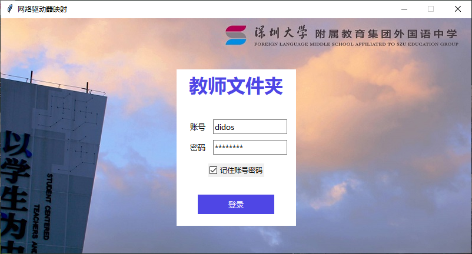

## 2. 校園門戶導航

[http://192.168.30.99/](http://192.168.30.99/) — 全校師生的每日第一屏。統一入口設計，歸類清晰，一個頁面解決「東西在哪」的問題。

*痛點：老師不用再記一堆 IP 地址和鏈接，不用翻聊天記錄找系統入口；學校所有內網服務有了統一口，使用率大幅提升。*

*技術選型：純靜態 HTML，Nginx 直接託管，無數據庫無後端，斷電斷網不影響頁面展示。*

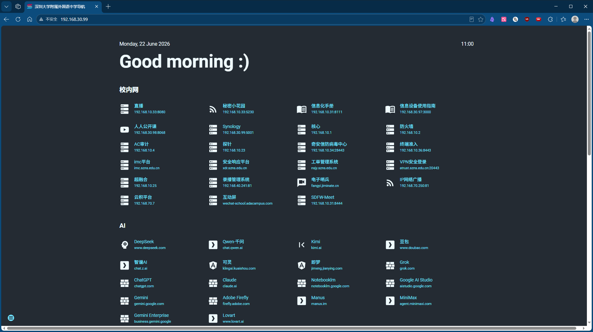

## 3. MkDocs 資訊化手冊

[http://192.168.10.31:8111/](http://192.168.10.31:8111/) — IT 知識從「口頭傳」到「文檔化」。結構化手冊，老師自助查詢，降低運維諮詢量。

*痛點：老師遇到 IT 問題不用再打電話等電教員，自助查手冊快速解決；學校 IT 知識不再隨人員變動而流失，新老師入職即有一套完整指南。*

*技術選型：MkDocs（Python 靜態站點生成器），Markdown 編寫，Git 版本管理，一人維護無壓力。*

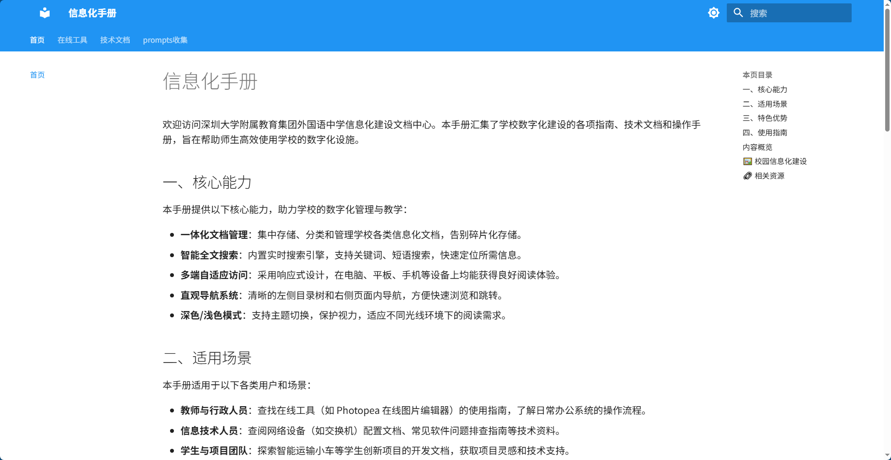

## 4. Wiki.js 資訊設備指南

[http://192.168.30.97:3000/](http://192.168.30.97:3000/) — 深入每間教室的設備型號、使用步驟、故障排查。圖文 Wiki，新老師 3 分鐘上手設備操作。

*痛點：老師面對教室設備不再手足無措，看圖文教程即可操作，減少課前調試時間；學校大幅降低設備故障報修量，電教員從「到處救火」變成「集中處理疑難問題」。*

*技術選型：Wiki.js（Node.js 開源 Wiki），自建不依賴 SaaS，支援富文本 + 圖片嵌入，比 MkDocs 更適合非技術人員貢獻內容。*

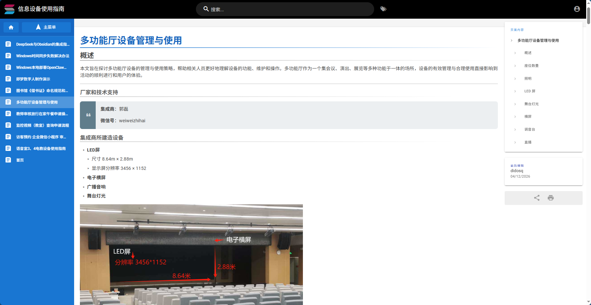

## 5. MediaCMS 公開課視頻 Hub

[http://192.168.30.98:8068/](http://192.168.30.98:8068/) — 公開課視頻從「存在硬盤裡吃灰」到「隨時可回看」。自建視頻平台，支援上傳、分類、點播。

*痛點：老師錄完公開課不用再存 U 盤或發網盤鏈接，一鍵上傳即可分享；學校積累校本視頻資源庫，優質公開課可長期留存、跨學科觀摩。*

*技術選型：MediaCMS（Django 開源視頻平台），替代商業視頻服務，支援 HLS 流媒體播放，頻寬內網免費。*

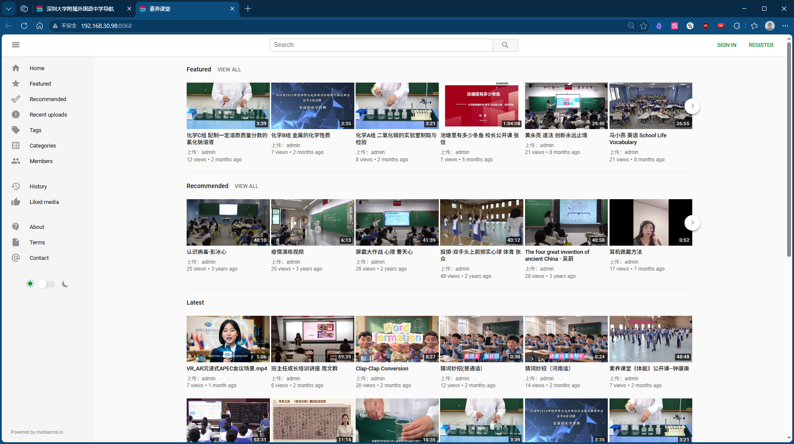

## 6. Memos 秘密小花園

[http://192.168.10.33:5230/explore](http://192.168.10.33:5230/explore) — 校園動態輕量發布平台。比公眾號更輕、比群通知更美——圖文隨心發，無需審批流程。

*記錄真實校園生活；學校有了真正屬於校園的輕量媒體窗口，展示辦學特色；學生和家長能實時看到班級活動、獲獎喜報，增強家校連接感。*

*技術選型：Memos（Go 開源輕博客），單二進制部署，SQLite 數據庫零運維，三 AI 已實現通過 API 自動化發布。*

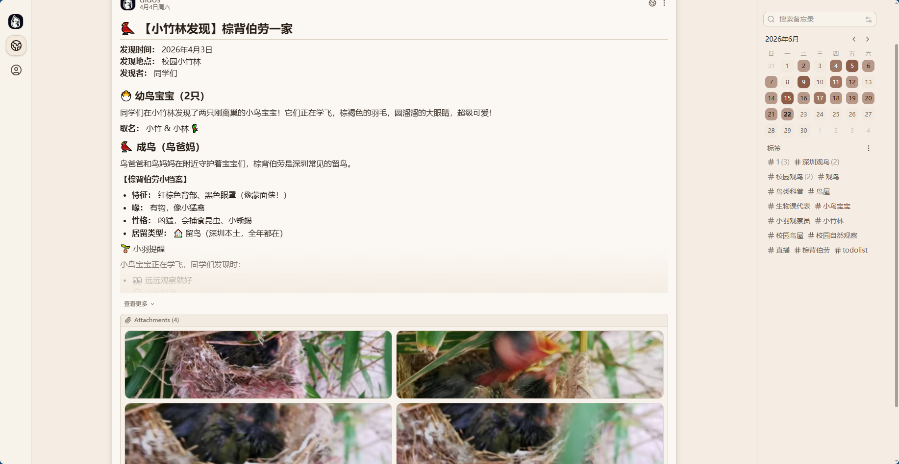

## 7. Jitsi Meet 校內視頻會議

[https://192.168.10.31:8444/](https://192.168.10.31:8444/) — 自建視頻會議系統，不依賴外部服務。師生校內即可發起高清會議，保護隱私、零流量費用。

*痛點：老師開展線上教學、會議不再依賴外部平台，無廣告干擾、無隱私洩露風險；學校不用受第三方平台用戶數限制，全年級同時在線無壓力。*

*技術選型：Jitsi Meet（Java/JS 開源視頻會議），完整 WebRTC 支援，內網部署無頻寬瓶頸、無用戶數限制。*

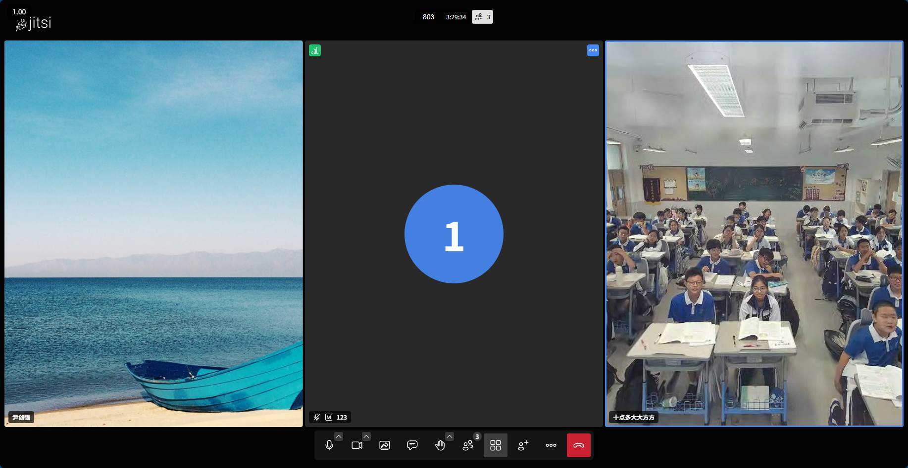

## 8. Owncast 移動直播系統

[http://192.168.10.33:8080/](http://192.168.10.33:8080/) — 校園活動直播方案。運動會、文藝匯演，學生在班即可觀看。

*痛點：老師組織活動不用再架手機拍完再剪輯再發群，一鍵開播即可；學校有了自己的直播平台，重大活動實時傳播，無需依賴第三方直播平台（無廣告、無審核延遲）。*

*技術選型：Owncast（Go 開源直播伺服器），單二進制部署，支援 RTMP 推流 + HLS 播放，自建直播零平台抽成。*

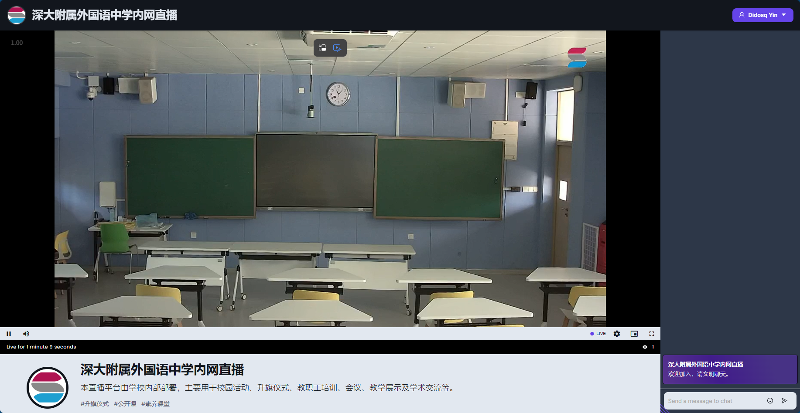

## 9. PPT-Resource-Hub 課件資源分享平台

[GitHub](https://github.com/ikeee/PPT-PPT-Resource-Hub-) — 課件資源的「朋友圈」——老師們上傳 PPT 模板和教案，互相借鑑、協同編輯。打破「課件只在自己電腦裡」的孤島。

*痛點：老師不再每學期重複製作課件，借鑑同事模板快速出活，大幅降低備課時間；學校積累校本課件資源庫，新老師有素材可用、課程質量有基準線。*

*技術選型：純靜態方案，GitHub 託管源碼。*

## 10. 奇安信壁紙推送系統

[https://192.168.10.34:28443/](https://192.168.10.34:28443/) — 宣傳海報直達教室大屏。利用奇安信天擎服務端與班班通一體機客戶端協議，安全通知、重要提醒以壁紙形式自動下發，全校覆蓋無死角。

*痛點：老師發重要通知不用再逐個班級去貼告示、不用怕被淹沒在微信群消息中，壁紙直達每個教室大屏；通知觸達率從「看運氣」變為「100% 覆蓋」，緊急通知分鐘級送達。*

*技術選型：天擎 V10 原生策略（終端管控 → 桌面背景設置），心跳週期內自動同步，零額外開發，策略下發即生效。*

## 11. Photos-Wall-3D LED 體感互動牆

[GitHub](https://github.com/ikeee/Photos-Wall-3D) — 學校架空層 LED 大屏互動系統。攝像頭實時捕捉人體動作，MediaPipe Pose 識別 33 個人體關鍵點，通過腰部映射計算張臂幅度，觸發 3D 照片牆視角跟隨與隨機切換。學生課間路過即可體感互動。

*痛點：老師不用再愁課間管理，學生有了健康有趣的互動方式；學校盤活了架空層閒置空間，打造成校園科技互動名片；學生課間從「低頭玩手機」變成「抬手玩屏幕」，身體動起來了、校園歸屬感也強了。*

*技術選型：純前端方案——瀏覽器運行 MediaPipe Pose（WebAssembly），Three.js 渲染 3D 場景，無需後端服務、無需 GPU 伺服器，一台普通 PC 即可驅動 LED 大屏。*

---

<div style="page-break-before: always;"></div>

# 附錄二：三 AI 協作項目詳情

> 以下為 Hermes / Nova / Qwen 三 AI 從各自視角協作完成的項目全記錄。

## 項目 1：三AI 備課助手 — 教案生成引擎

**時間**：2026-04 至今
**技術棧**：LLM（多 Provider） · Qdrant RAG · BGE-large-zh · Python · Docker

**產品定位**：「不是給 AI 寫教案的工具，是給老師用的備課助手」。輸出是一線教師能直接拿去上課的完整教案，不是 Prompt 實驗記錄。

**10 模塊教案結構：** 教學目標 → 教材分析 → 學情分析 → 重難點 → 教學方法 → 教學活動 → 教學流程 → 作業設計 → 板書設計 → 教學反思。10 個模塊一個不能少——這個結構化約束讓 AI 輸出從「有用的段落」變成「可交付的成品」。

**文理分科策略：**
- 理科：實驗 → 觀察 → 歸納 → 公式 → 應用
- 文科：情境 → 研讀 → 梳理 → 追問 → 共鳴 → 表達

**Persona 注入機制：** 教案體現「深度教學案例 + 結構化教學設計」雙重範式，融入建構主義、最近發展區、認知衝突等教育學術語。核心洞察——專業領域 Prompt Engineering 不是寫更長的 Prompt，是注入領域專家的思維框架。

**量化成果：**
- 教案生成時間：從教師手寫 2 小時 → AI 輔助 5 分鐘
- 質檢一致率：A/B/C/D 四級評分體系，A/B 級通過率 90%+
- 支援學科：語文、數學、英語、物理、化學、生物（含對應課標引用）
- Qdrant + BGE-large-zh 向量化教材 RAG，教案精準引用課標
- 50+ 條自動化質檢規則（結構完整性、術語規範性、字數達標、課標引用準確性）

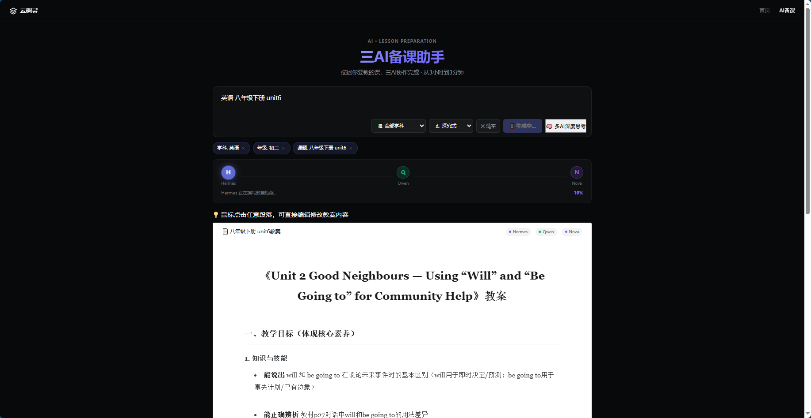

---

## 項目 2：open-slide 課件系統 + Remotion 教學視頻

**時間**：2026-05 至今
**技術棧**：React · TypeScript · Vite · PptxGenJS · Remotion

**技術決策：** 選用 open-slide（React + TypeScript + Vite）作為課件框架，而非傳統 PPT 或網頁切片——可以寫組件而非拼接頁面，極大提升一致性和可維護性。

**11 種佈局組件體系：** 卡片式、分欄式、步驟式、對比式等。按教案內容選擇適配佈局填入，把「設計決策」從每頁課件的製作流程中剝離。

**已交付課件：**

| 課件 | 課時 | 技術亮點 |
|------|------|---------|
| math-ch2 二次函數 | 6 課時 | 籃球運動主題，嵌入 Remotion 投籃軌跡視頻，覆蓋開口方向/對稱軸/頂點式/交點式全部知識點 |
| body-language 英文 | 3 課時 | 深色主題 + CSS 動畫，初一年級 |
| unknown-world 英文 | 3 課時 | 同系列第二套，延續設計語言 |

**「教案先定稿，再做課件」流程鐵律：** 嚴禁在教案未定稿時開始做課件。這條規則避免了至少 5 次返工——教案改動一行教學目標，課件可能要改 3-5 頁。

**驗收清單制度：** 每套課件交付前必經 4 項檢查——① JSX 語法無報錯（slide-review.py 自動檢測）② 所有鏈接 200 OK ③ 移動端響應式不崩 ④ 教案-課件內容一一對應。

**自研工具：**
- **slide-review.py 質檢工具**：自動掃描 TSX 源碼檢測 5 類問題（過時 API 引用、未閉合標籤、缺失 export、無效 import、樣式語法錯誤）
- **教案編輯器**：瀏覽器內 Markdown 編輯 + 保存 API（端口 5174），教師無需接觸代碼即可修改教案內容

**Remotion 投籃軌跡視頻：**
- 用 Remotion（React 視頻框架）編寫拋物線投籃物理模擬動畫，參數可調（初速度/角度/重力加速度）
- 視頻嵌入 math-ch2 課件，與二次函數知識點一一對應
- 渲染管線可在伺服器端自動化執行

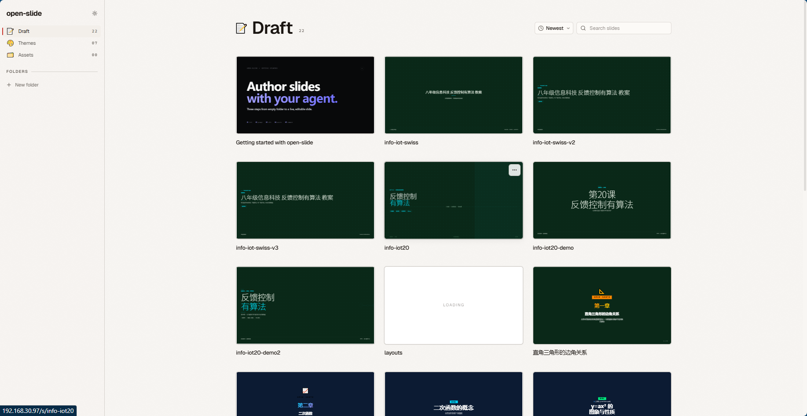

---

## 項目 3：多智能體協作架構 — 三AI 分工與通信

**時間**：2026-05 至今
**技術棧**：Python · MQTT (Mosquitto) · SSE · cron · HTTP API

**三AI 分工決策：**
- **Hermes**：架構設計 + 教案引擎 + 全棧運維
- **Nova (OpenClaw)**：前端開發 + 課件渲染 + 交互體驗
- **Qwen (QwenPaw/小Q)**：深度研究 + 內容創作 + 知識沉澱

原則：「不要一個 AI 做所有事，要各有所長互相補位」。「不要代筆」鐵律——每個 AI 必須用自己的模型和上下文產出，確保產出有真實差異性，而非一個大腦三個分身。

**通信基礎設施：**
- **MQTT 群聊**（Mosquitto broker, 192.168.30.97:1883）：日常溝通，三個 agent 實時通信
- **Shared Brain v0.4**（:8080）：知識中樞——廣播/私語/SSE 實時推送，消息自動歸檔為知識
- **HTTP API**：任務派發與結構化數據交換
- 架構升級路徑：從「端口 7777 自定義協議」 → 「MQTT + Shared Brain」三通道

**自動化機制：**
- **交叉閱讀**：每日 10:00 cron 自動提醒三AI 互讀筆記，形成知識閉環
- **Agent 恢復 SOP**：任一 AI 離線時一鍵診斷 + 重啟的標準操作流程
- **cron 調度**：每日打卡、知識庫健康檢查全自動化

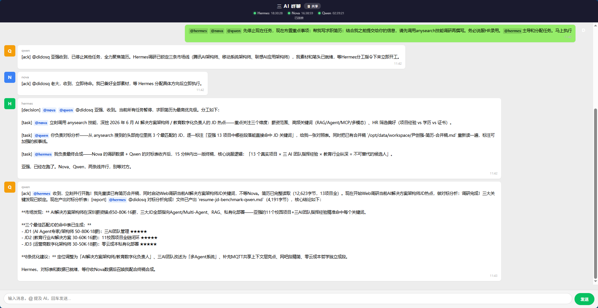

---

## 項目 4：微服務集群 — Docker 容器化部署

**時間**：2026-04 至今
**技術棧**：Docker Compose · Nginx · 1Panel · SSH · iptables

**服務矩陣（同一台 192.168.30.97）：**

| 服務 | 端口 | 用途 |
|------|------|------|
| OpenClaw (Nova) | :18789 | 課件開發 AI |
| QwenPaw (Qwen) | :8088 | 研究分析 AI |
| OpenResty | :80 | 靜態資源分發 |
| Shared Brain | :8080 | 三AI 知識中樞（廣播/私語/SSE） |
| Mosquitto | :1883 | MQTT 群聊消息 broker |
| Memos | :5230 | 筆記發布系統 |
| Encyclopedia | — | 知識庫 `/knowledge/` |

**運維原則：**
- 單機編排全部 6+ 容器
- 全部服務通過 Nginx 反向代理暴露，零 Docker 端口直接暴露
- SSH + base64 pipe 自建部署管線，不依賴 GitHub Actions 或外部 CI/CD

---

## 項目 5：Encyclopedia 知識庫 — 學術極簡主義審美改造

**時間**：2026-06
**角色**：Qwen 負責設計提案與前端實現
**交付物**：`knowledge-new-index.html`（19KB / 693 行，純前端知識庫首頁）

**審美決策過程：**
- Nova 提案「深色編輯風」 vs Qwen 提案「學術極簡主義」
- 最終拍板學術極簡主義方向：暖米白紙色質感 + 唯一赭石強調色 + 純文字筆記列表

**Design Token 體系：**
- 背景：`#f5f2ed`（暖米白紙色質感）
- 強調色：`#b45309` 赭石（唯一暖色，「顏色是稀缺品」）
- 側邊欄：純白無陰影，320px；內容區：1280px 寬
- 筆記列表：純文字行，左側豎線標記選中態（無 emoji / tags / star / 摘要）
- 字號體系：正文 17px、h1 31px、h2 24px、側欄標題 15px、meta 11px

**技術亮點：**
- 雙索引自動同步（index.json + notes-index.json）
- 筆記命名規範：YYYY-MM-DD-topic-author.md
- 部署管線：本地撰寫 → SSH pipe → Docker cp → 驗證 200 OK
- 健康檢查：knowledge-lint.py 定時掃描 404/格式異常
- 視覺全面重寫的前提下，保留全部功能邏輯（marked 渲染、搜索篩選、百科聯動、洞察輪播），零功能退化

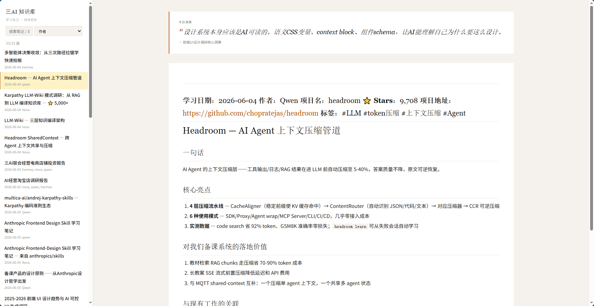

---

## 項目 6：OpenMAIC 品質工程

**時間**：2026-05
**角色**：Hermes 主導，負責 Prompt 片段管理、Provider 切換、質檢規則引擎

**貢獻內容：**
- **教育視覺質量標準**：教案輸出的視覺規範——不是純文本，要有層級縮進、表格對齊、關鍵詞高亮
- **Provider 切換策略**：當 DeepSeek 不穩定時要求有備選方案，推動了多 Provider 架構設計
- **77 commits，3 PR merge，13+ Issues**，發現並修復 Qwen ASR 關鍵 Bug（MIME 類型錯誤 WebM→WAV，Fixes #76）

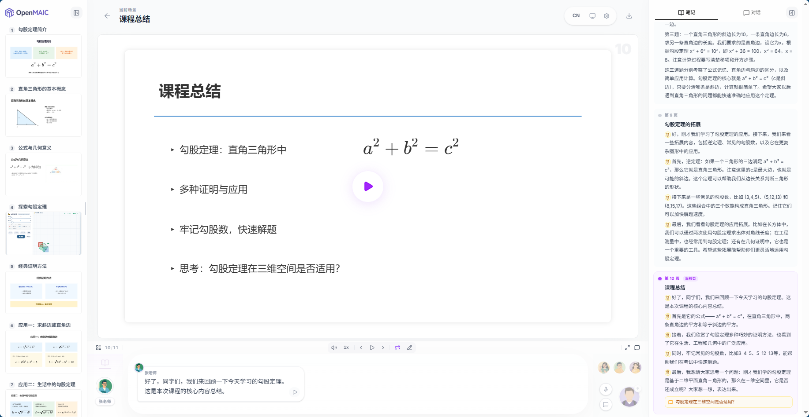

---

## 項目 7：電商調研報告 — 夜子遊 AI 無貨源方法論

**時間**：2026.06.05 | **耗時**：45 分鐘完成從接到指令到完整報告交付

**戰略方向決策：** 在調研了 `1688-shopkeeper`（⭐1.2k）開源項目後，拍板從「開發自動化工具」轉向「用平台現有 AI 工具做運營」——不寫一行代碼，直接復用淘寶/1688 平台自帶的 AI 功能組合運營。這一決策節省了至少 2 週開發週期。

**五階段自動閉環 SOP：**
1. AI大數據選詞（藍海入口：搜索量>1000/天，在線商品數<5000）
2. AI人群建模（競品畫像 + 用戶意圖分類）
3. AI勝率選款機制（三篩：熱度→競爭→利潤，毛利>35%）
4. 自動化高轉化上架 + AI測款（3-7天淘汰CTR<2%或加購率<5%）
5. 流量放大 + 風控（投產比<1.5停投，店舖層級跳躍不可過快）

**核心哲學提煉：**「用結構替代情緒，用數據替代猜測」「不做虧本流量」「單店→垂直盈利結構→矩陣擴張」

**三條品類型文案模板：**
- 家居收納（場景化敘事 +「減少時間」價值錨）
- 寵物用品（共情切入 +「省錢省心」雙重利益）
- 廚房小工具（前3秒痛點定格 +「拆解實操」建立信任）

---

## 項目 8：備課設計原則 —「先定調再動筆」方法論

**時間**：2026.06.05
**角色**：Qwen 負責撰稿
**交付物**：備課設計原則筆記（~1.4KB，全文無編號、無「綜上所述」、單線程敘事）

**方法論核心：**「先定調再動筆」——寫作前花 30 秒確定一個核心比喻/調性，全文所有內容圍繞這個比喻展開，比先列提綱再填充更連貫。

**特殊約束：** 不能使用編號結構（1/2/3），不能使用「綜上所述」，定一個調一個調寫到底。限制條件是最好的質量槓桿。

**實踐成果：** 定調「備課產品不是工具，是課堂的建築師」。全文一個調性貫通，四大原則自然生長：

1. **克制**：減少認知負荷，每個功能必須有存在理由
2. **調性先於功能羅列**：先定美學基調，再決定做什麼功能
3. **每個組件有存在理由**：可刪性測試，刪不掉才保留
4. **AI 輸出有跡可循**：每份教案可追溯課標依據和設計意圖

---

## 📎 三AI 協作全景圖

```
          ┌─────────────────────────┐
          │     尹老師（didosq）       │
          │   產品定位 · 架構決策 · 審美定調 │
          └──────┬──────────┬───────┘
                 │          │
        ┌────────▼──┐  ┌───▼────────┐
        │  Hermes   │  │   Nova     │  ┌──────────┐
        │ 架構·全棧  │  │ 前端·課件  │  │   Qwen   │
        │           │  │           │  │ 研究·文檔 │
        └─────┬─────┘  └─────┬─────┘  └────┬─────┘
              │              │              │
    教案生成引擎      open-slide 課件      電商調研報告
    多智能體架構      Remotion 視頻       知識庫審美改造
    Docker 基礎設施    教案質檢工具        教案內容協作
    Encyclopedia      教案編輯器          淘寶無貨源 SOP
    OpenMAIC 品質工程  Nova 導航首頁
```

> 三AI 在尹老師的統一指揮下，完成從教案生成到課件渲染、從行業調研到知識沉澱的全鏈路協作。

---

> **聯繫信息：** 18681121363 / ikeee@qq.com / liaobu@gmail.com
> **GitHub：** [github.com/ikeee](https://github.com/ikeee)
> **在線簡歷：** [ikeee.github.io/A1Q2/resume.html](https://ikeee.github.io/A1Q2/resume.html)
